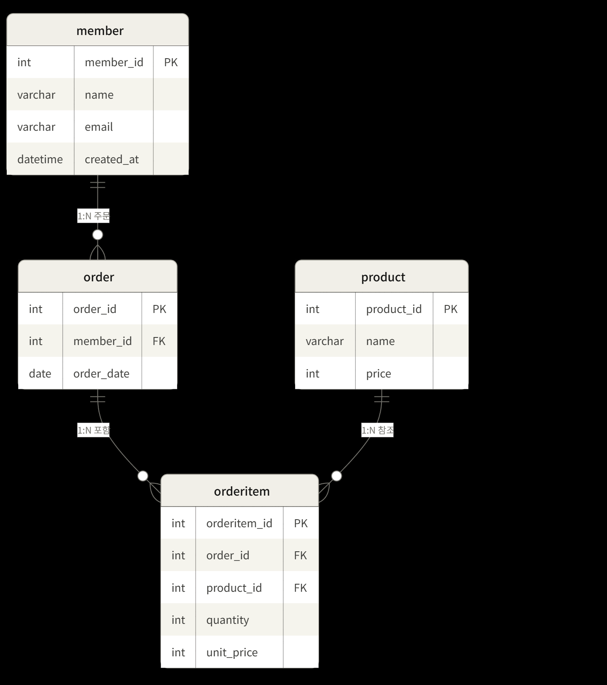

## 1. 쇼핑몰 주문 시스템 DB

  
### (1) 요구사항 정의
1. 회원 관리 (Member) 
회원 정보를 저장한다 (이름, 이메일, 가입일시) 
한 회원은 여러 주문을 할 수 있다  
2. 상품 관리 (Product) 
상품 정보를 저장한다 (상품명, 가격) 
주문되지 않은 상품도 목록에 포함되어야 한다  
3. 주문 관리 (Order) 
주문은 특정 회원에 의해 생성된다 
주문일자를 기록하며, 연·월·일 형식으로 조회 가능해야 한다  
4. 주문 상세 관리 (OrderItem) 
한 주문에는 여러 상품이 포함될 수 있다 
각 항목마다 수량과 주문 당시 단가를 기록한다 (가격 변동 대응)  
5. 조회 요구사항 
특정 회원의 이름·이메일·가입일·주문일을 조회할 수 있어야 한다 
상품별 주문 건수를 조회할 수 있어야 한다 (주문 없는 상품도 포함) 
회원별 주문 내역과 제품명·가격을 함께 조회할 수 있어야 한다  

     
### (1) ERD
