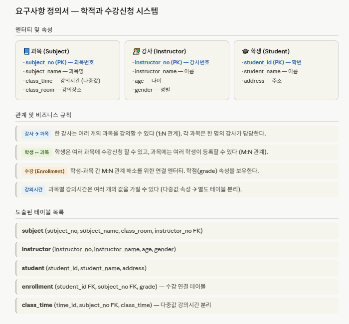
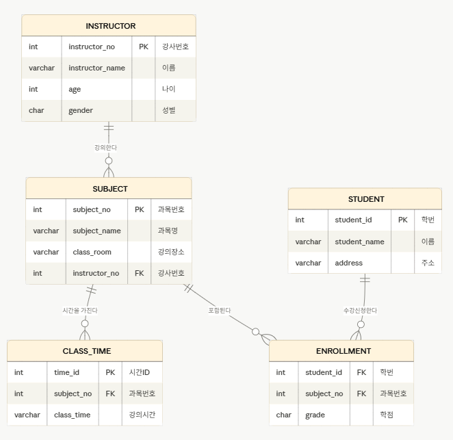

## 1. 학적과 수강신청

▷ 학적과에는 각 과목을 강의하는 강사, 등록한 학생, 강의가 이루어지는 시간(여러개의 값) 및 장소 등의 데이터가 유지된다.  
▷ 한 강사가 여러 개의 과목을 강의할 수 있으며, 각 과목과 학생 간에는 학점이 부여된다.  
▷ 과목에 대해서는 과목번호, 과목명 등의 정보가 유지되어야 한다.  
▷ 강사에 대해서는 강사번호, 이름, 나이, 성별 등의 정보가 유지되어야 한다.  
▷ 학생에 대해서는 학번, 이름, 주소 등의 정보가 유지되어야 한다. 

     
#### (2) ERD
