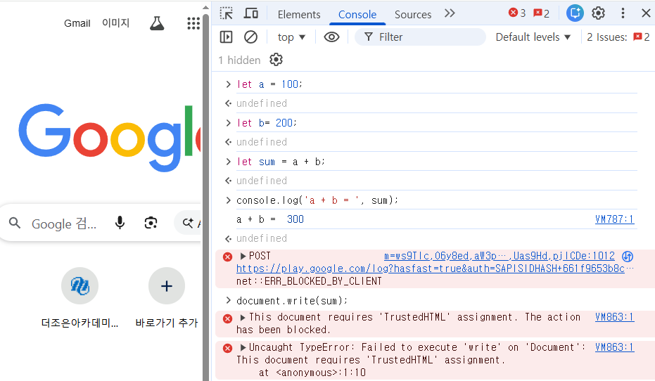

# 1. 자바스크립트 소개 및 개발환경 구성

## 1️⃣  자바스크립트란?

### (1) 정의

- JavaScript는 웹 페이지에 **동적인 기능**을 추가하기 위해 만들어진 프로그래밍 언어입니다.

### (2) 웹의 3요소

- HTML → 구조 (뼈대)
- CSS    → 스타일 (디자인)
- JavaScript → 동작 (기능)

### (3) 역사

| 연도 | 내용 |
| --- | --- |
| 1995 | 넷스케이프에서 Brendan Eich(브랜든 아이크)가 10일 만에 개발 |
| 1997 | ECMAScript 표준으로 채택 |
| 2009 | Node.js 등장 → 서버에서도 JS 실행 가능 |
| 2015 | ES6(ES2015) 대규모 업데이트 → 현대 JS의 기준 |
| 현재 | 매년 새 버전 업데이트 (ES2024) |

### (4) 특징

① 인터프리터 언어 -  컴파일 없이 브라우저/Node.js 가 코드를 바로 읽고 실행한다.

② 동적 타입 - 변수 선언 시 타입을 지정하지 않아도 된다.

③ ✨싱글 스레드 - 한 번에 하나의 작업만 처리하지만, 비동기 처리로 효율적으로 동작한다.

④ 이벤트 기반 - 클릭, 입력, 스크롤 등 사용자 행동에 반응하여 동작한다.

### (5) 실행 환경

| 환경 | 설명 |
| --- | --- |
| 브라우저 | Chrome, Firefox 등에 JS 엔진 내장 |
| Node.js | 로컬 환경에서 JS 코드 실행 가능 환경 제공, 서버, 터미널에서 JS 파일 실행 |

### (6) 사용 범위

| 범위 | 연동  언어 및 서버 |
| --- | --- |
| 프론트 엔드 | React(리액트), Vue(뷰), Next.js(넥스트JS) 등.. |
| 백엔드 | Node.js(노드JS), Express(익스프레스:NodeJS 라이브러리) |
| 모바일 앱 | React Native |

## 2️⃣  자바스크립트 vs 자바(Java)

### (1) 탄생 배경

|  | JavaScript | Java |
| --- | --- | --- |
| 개발 | Brendan Eich (넷스케이프) | James Gosling (Sun) |
| 연도 | 1995 | 1995 |
| 목적 | 웹 페이지에 동적 기능 추가 | 플랫폼 독립적인 범용 언어 |
| 이름 유래 | 당시 인기였던 Java 마케팅 활용 | 커피 원산지 섬 이름 |

<aside>
💡

JavaScript는 **넷스케이프(Netscape)** 와 **Sun Microsystems** 가 협업해서 만들어짐

원래 이름: Mocha → LiveScript → JavaScript

넷스케이프가 당시 엄청난 인기였던 Sun의 "Java" 이름을 빌려 "JavaScript" 로 최종 명명
→ 마케팅 목적의 협업!

</aside>

## 3️⃣  개발 환경

### (1) 브라우저별 자바스크립트 엔진

| 브라우저 | JS 엔진 | 개발사 | 특징 |
| --- | --- | --- | --- |
| **Chrome** | V8 | Google | 가장 빠름, Node.js도 사용 |
| **Edge** | V8 | Microsoft | 크로미움 기반으로 V8 채택 |
| **Firefox** | SpiderMonkey | Mozilla | 최초의 JS 엔진 |
| **Safari** | JavaScriptCore (Nitro) | Apple | iOS/macOS 기본 브라우저 |
| **Opera** | V8 | Opera | 크로미움 기반으로 V8 채택 |
| **Node.js** | V8 | Google | 서버 사이드 JS 실행, 로컬에서 실행 |

<aside>
💡

Chromium = 구글이 만든 오픈소스 브라우저 프로젝트
Chrome   = Chromium + 구글 전용 기능 추가한 제품

🎯 크로미움(오픈소스) = ‘공개된 설계도’

</aside>

### (3) 브라우저 환경에서의 개발

**✅ 1) HTML 파일 생성 후 실행**

```jsx
<!DOCTYPE html>
<html lang="en">
<head>
    <meta charset="UTF-8">
    <meta name="viewport" content="width=device-width, initial-scale=1.0">
    <title>JavaScript</title>
</head>
<body>
        <script>
        let a = 100;
        let b = 200;
        let sum = a + b;
        console.log('a + b = ', sum);
        document.write('a + b = ' + sum);
    </script>
</body>
</html>
```

**✅ 2) 브라우저의 콘솔창 이용**



### (4) ✨로컬 환경에서의 개발

**✅ 1) Node.js 개요**

- 브라우저 없이 JS를 실행할 수 있는 런타임 환경 (로컬)
- 서버, 툴, 스크립트 등 다양한 환경에서 JS 사용이 가능해짐
- npm(패키지 관리자)  포함 → 수많은 라이브러리 사용 가능

**✅ 2) Node.js 다운로드**

① 다운로드 사이트 :  [https://nodejs.org/ko](https://nodejs.org/ko) 

② LTS (Long Term Support) 버전 선택 : 안정적인 버전

③ 운영체제에 맞게 다운로드 후 설치

④ msi 파일로 다운로드

**✅ 3) Node.js 설치**


**✅ 4) Node.js 설치 확인**

```jsx
node -v  //Node.js 버전 확인
npm -v   //npm 버전 확인
```

**✅ 5) VSCode 개발환경 설정**

- 터미널 열기 : 메뉴 > Terminal > New Terminal
    
    단축키 : ctrl + shift + ‘(백틱, ~ 키보드 아래 문자)
    
- 터미널에서 버전 확인
    - 윈도우의 보안 인증으로 npm이 실행 안됨
    
    
    
    - 해결 방법
    
    디폴트로 실행되는 PowerShell이 아닌 Command Prompt를 실행한다.
    
    
    
    - Command Prompt에서 버전 확인
    
    
    

### (5) JS 파일 생성 후 실행

- hello.js

```jsx
/**
 * .js 파일 형식으로 저장하여 실행
 * 실행 방법 : 터미널 > node [파일명.js]
 */

//Welcome to JavaScript World!! 출력
let msg = "Welcome to JavaScript World!!🎈🎎🎐";
console.log(msg);
```

